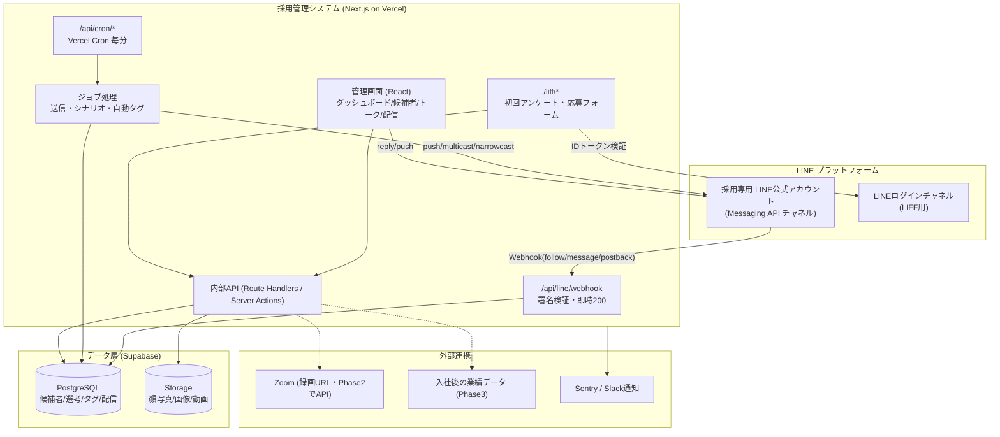

# 01. 技術構成とシステムアーキテクチャ

対象：要件定義書 v1 第2章（基本システム構成）／第27章（開発方針 2〜3）

---

## 1. 結論（推奨構成）

| レイヤ | 採用技術 | 選定理由 |
| --- | --- | --- |
| 言語 | **TypeScript** | 画面・API・バッチ・LIFF を1言語で統一。LINE の型定義（`@line/bot-sdk`）が公式提供されている |
| アプリ基盤 | **Next.js 15（App Router）** | 管理画面（React）と API（Route Handlers）を1つのコードベースで持てる。Webhook / Cron / 画面を分離デプロイしなくてよい |
| UI | **React 19 + Tailwind CSS + shadcn/ui** | Lステップ風の「左サイドメニュー＋データ密度の高い一覧」を短期間で作れる。コンポーネントを自前所有できるためカスタムが効く |
| 一覧・表 | **TanStack Table + TanStack Query** | 候補者一覧の絞り込み・ソート・仮想スクロール、サーバ状態のキャッシュ |
| グラフ | **Recharts** | ダッシュボード／ファネル。軽量で十分 |
| DB | **PostgreSQL（Supabase）** | リレーション中心の採用データに最適。JSONB でフォーム回答やシナリオ条件など可変構造も扱える。全文検索・集計・PITR バックアップまで単体で完結 |
| ORM | **Prisma** | スキーマ駆動・マイグレーション管理・型安全。テーブル数が多い本件で保守性が高い |
| ファイル保管 | **Supabase Storage** | 顔写真・リッチメニュー画像・テンプレート動画・LINE 受信メディア。署名付きURL と公開バケットを使い分け |
| 認証 | **Auth.js v5（Google OAuth）＋ 許可ユーザーテーブル** | 初期利用者2名。Google アカウントでログインし、`users` に登録済みのメールのみ許可。パスワード管理が不要で安全 |
| 非同期処理 | **Postgres ジョブテーブル ＋ Vercel Cron（毎分）** | LINE 送信・シナリオ配信・重い後処理を確実に順序制御。外部キュー製品への依存なしで開始し、規模拡大時に差し替え可能な抽象化を置く |
| ホスティング | **Vercel** | 既存の NAORU ダッシュボードと同じ運用。Preview 環境が自動で立つため検証用 LINE チャネルと相性が良い |
| 監視 | **Sentry ＋ Vercel Logs ＋ Slack 通知** | Webhook 失敗・配信失敗を即検知 |
| バリデーション | **Zod** | フォーム定義・Webhook ペイロード・API 入力を1箇所で型と検証を共有 |
| テスト | **Vitest（単体）＋ Playwright（主要導線E2E）** | 選考ステータス遷移と配信ロジックに絞って自動テスト |

### この構成を選ぶ理由（要件2の6条件との対応）

| 要件2の条件 | 対応 |
| --- | --- |
| LINE Messaging API と安定連携 | Webhook は署名検証 → 生イベントを DB 保存 → 即 200 応答 → 非同期処理、の分離構成（詳細は `03`）。LINE 側の再送・重複に耐える |
| 将来的な機能追加がしやすい | 採用フェーズ・タグ・フォーム項目・シナリオ条件をすべて **DB のデータとして持つ**（コード埋め込みにしない）。フェーズ追加や項目追加をデプロイなしで実施できる |
| 採用データを安全に管理 | 顔写真・給与を扱うため、TLS／保存時暗号化／署名付きURL／監査ログ／ログイン許可制／PITR バックアップを標準装備（第6節） |
| 開発・保守がしやすい | 単一リポジトリ・単一言語・Prisma マイグレーション。担当者が1〜2名でも回る構成 |
| API 連携が追加しやすい | 外部連携（Zoom、入社後の業績データ）を `integrations` 配下のアダプタ層に隔離。候補者⇔従業員の突合キーを最初から用意（`24章`対応） |
| 管理画面が高速 | サーバ側で集計済みの値を返し、一覧は仮想スクロール＋インデックス設計。ダッシュボードはステータス別カウントを集計クエリ1本で取得 |

---

## 2. 他案との比較（なぜ他を採らないか）

| 案 | 長所 | 短所 | 判定 |
| --- | --- | --- | --- |
| **A. Next.js + Vercel + Supabase**（推奨） | 1言語・1リポジトリ、既存運用と同じ、初期コスト最小、Preview 環境が使える | 長時間バッチは分割実行が必要（対策あり・第5節） | ◎ 採用 |
| B. Ruby on Rails + Render/Heroku | 管理画面の作り込みが速い、バッチ（Sidekiq）が強い | フロントの作り込みで JS が別言語になり保守が2系統。Vercel 運用資産を活かせない | △ |
| C. NestJS API + React SPA（別デプロイ）+ Fly.io | 責務分離が明確、大規模化に強い | リポジトリ・デプロイ・認証が2系統になり、2名運用には過剰 | △ |
| D. Lステップ等の既製ツール併用 | すぐ使える | 選考管理・評価・エリアマッチング・入社後分析まで踏み込めず、結局データが分散する（本件の目的と矛盾） | × |

> 補足：**LINE 配信部分だけ Lステップを使い、ATS を自作する**という折衷案もあり得るが、要件10（複数シナリオ同時参加・ステータス連動の停止条件）と要件19（ダッシュボード）を成立させるには、配信と選考ステータスが同じ DB にある必要があるため、統合実装を推奨する。

---

## 3. システム全体図



### 処理の流れ（代表3経路）

1. **友だち追加 →アンケート**
   `follow` イベント → 署名検証 → `webhook_events` に生保存 → 即 200 → ジョブで LINE プロフィール取得 → `candidates` / `line_friends` 作成（フェーズ = LINE登録）→ 挨拶テンプレート＋アンケート導線を送信 → タグ「LINE登録」付与。

2. **応募フォーム送信（要件6）**
   LIFF フォーム送信 → IDトークン検証で LINE ユーザーを確定 → `form_submissions` 保存＋候補者項目へマッピング → **1トランザクションで**「フェーズを応募済みへ変更・タグ付与・面談希望日時保存」→ 送信ジョブ登録（応募完了メッセージ、指定動画）→ 一次面談待ちへ。

3. **配信（Phase 2）**
   Cron（毎分）→ 送信予定のジョブを取得 → 停止条件（内定・ブロック・当日上限・重複）を再評価 → LINE API 送信 → 結果を `scenario_deliveries` / `messages` に記録。

---

## 4. アプリケーション構成（ディレクトリ案）

```
apps/recruiting/
├─ app/
│  ├─ (admin)/                     # 要ログイン。左サイドメニュー付きレイアウト
│  │  ├─ page.tsx                  # 採用ダッシュボード（トップ）
│  │  ├─ candidates/               # 候補者一覧・詳細・検索
│  │  ├─ pipeline/                 # 選考進捗（カンバン/一覧）
│  │  ├─ matching/                 # エリアマッチング・紹介履歴
│  │  ├─ offers/                   # 内定・入社管理
│  │  ├─ chat/                     # 1対1トーク
│  │  ├─ scenarios/ broadcasts/    # 配信（Phase2）
│  │  ├─ templates/ media/ rich-menus/
│  │  ├─ tags/ forms/
│  │  ├─ analytics/                # ファネル・流入・選考分析
│  │  └─ settings/                 # LINE設定・採用フロー設定・ユーザー
│  ├─ liff/
│  │  ├─ survey/                   # 初回アンケート
│  │  └─ apply/                    # 応募フォーム
│  └─ api/
│     ├─ line/webhook/route.ts     # Webhook 受信（署名検証・即時200）
│     ├─ cron/dispatch/route.ts    # 送信キュー処理（毎分）
│     ├─ cron/scenario/route.ts    # シナリオ進行（Phase2）
│     └─ internal/…                # 管理画面用API
├─ lib/
│  ├─ line/                        # Messaging APIクライアント・署名検証・メッセージ組立
│  ├─ jobs/                        # ジョブ登録/取得/リトライ（キュー抽象）
│  ├─ pipeline/                    # 選考フェーズ遷移ルール・履歴記録
│  ├─ scenario/                    # 配信条件評価（Phase2）
│  ├─ forms/                       # フォーム定義・回答マッピング・自動タグ
│  ├─ analytics/                   # ダッシュボード集計・ファネル
│  └─ integrations/                # zoom / hr など外部アダプタ
├─ prisma/schema.prisma
└─ tests/
```

**設置場所の提案**：本システムは既存の NAORU アカデミーダッシュボード（本リポジトリの `index.html` / `api/kpi.js`）とは別プロダクト（別ドメイン・別デプロイ・別 DB）になるため、**新規リポジトリで開発することを推奨**する。本リポジトリには設計ドキュメントのみを残す。

---

## 5. 非同期処理・配信基盤

LINE 連携では「Webhook に即応答」「大量配信をレート制限内で捌く」「失敗をリトライする」の3つが必須になるため、**すべての LINE 送信をジョブ経由に統一**する（管理画面からの1対1トーク送信のみ、即時性のため同期送信＋失敗時ジョブ化）。

- **キュー**：`message_jobs` テーブル（`run_at`, `status`, `attempts`, `locked_at`, `idempotency_key`）。`FOR UPDATE SKIP LOCKED` で多重実行を防止。
- **起動**：Vercel Cron（毎分）→ 1回の実行で最大 N 件を処理（実行時間の上限に収まるようチャンク化）。
- **リトライ**：指数バックオフ（1分 → 5分 → 30分 → 2時間、最大5回）。恒久エラー（ブロック済み等）は即時 `failed` にして配信停止フラグを立てる。
- **冪等性**：`idempotency_key`（例：`scenario:{enrollment_id}:{step_id}`）で二重送信を防止。LINE 側にも `X-Line-Retry-Key` を付与。
- **将来の差し替え**：件数が増えた場合（目安：1日あたり数万通超）、`lib/jobs` の実装のみ Inngest / QStash 等へ差し替えられるようインターフェースを固定する。

> 補足：Vercel のサーバレス関数には実行時間の上限があるため、一斉配信は「対象抽出（1ジョブ）→ 500件ずつの送信ジョブに分割」する設計とする（multicast は1リクエスト最大500ユーザー）。

---

## 6. セキュリティ・個人情報保護

採用データは氏名・顔写真・給与・家庭状況を含むため、通常のアプリより一段強い扱いをする。

| 項目 | 方針 |
| --- | --- |
| 通信 | 全経路 HTTPS。Webhook は LINE 署名（`x-line-signature`）検証必須、不一致は即 400 |
| 認証 | Google OAuth ＋ `users` テーブル許可制（未登録メールは弾く）。セッションは短め＋再認証 |
| 権限 | 初期は「管理者／一般」の2区分のみ（要件25）。ただし将来に備え `users.role` と操作ログは最初から用意 |
| 顔写真・添付 | 非公開バケットに保存し、管理画面では **短期有効の署名付きURL** で表示。LINE へ送信する画像・動画のみ、推測困難なパスの公開バケットを使用（LINE API は公開HTTPS URLを要求するため） |
| 保存時暗号化 | Supabase 標準（ディスク暗号化）。給与など特に機微な列はアプリ層での追加暗号化を選択可能とする（要判断・`05` 参照） |
| 監査ログ | 候補者情報の閲覧・更新、配信実行、エクスポートを `audit_logs` に記録 |
| バックアップ | 日次バックアップ＋PITR。復旧手順を運用ドキュメント化 |
| 秘密情報 | チャネルシークレット／アクセストークンは Vercel の環境変数。リポジトリに置かない |
| 保存期間 | 不採用・辞退から一定期間（例：2年）経過した応募者データの扱いをポリシー化（要判断・`05` 参照） |
| 応募者への明示 | フォームに個人情報の利用目的・同意チェックを設置 |

---

## 7. 環境構成

| 環境 | 用途 | LINE チャネル | DB |
| --- | --- | --- | --- |
| local | 開発 | 検証用チャネル（Webhook は ngrok 等でトンネル） | ローカル Postgres（Docker） |
| preview | Pull Request ごとの確認 | 検証用チャネル | Supabase（開発用プロジェクト） |
| production | 本番 | 本番の採用専用アカウント | Supabase（本番プロジェクト） |

**注意点**：LINE の Webhook URL はチャネルごとに1つのため、`preview` 環境で共有する場合は「固定の検証用 URL に集約 → 環境変数で振り分け」または「検証用チャネルを複数作成」のいずれかを運用ルールとして決める。

---

## 8. 運用コストの目安（要確認）

| 項目 | 目安（月額） | 備考 |
| --- | --- | --- |
| Vercel | 無料〜数千円 | Pro プランはメンバー数課金 |
| Supabase | 無料〜約4,000円 | 本番はバックアップ・PITR のため有料プラン推奨 |
| LINE 公式アカウント | 0円〜1.5万円程度＋従量 | 配信通数に応じたプラン選択。**最新の料金プランは契約時に要確認** |
| Sentry 等監視 | 0円〜数千円 | 無料枠で開始可 |

配信通数が増えるほど LINE のメッセージ料金が支配的になるため、シナリオ配信の設計（1日あたり送信数の上限・重複配信防止）はコスト面でも効いてくる。

---

## 9. 主要な技術的判断（レビューして頂きたい点）

1. **LIFF を使う**：リッチメニューの URL アクションは全友だち共通の固定 URL であり、個別トークンを URL に埋め込めない。そのため「リッチメニュー → 応募フォーム」で本人を特定するには LIFF（LINEログインチャネル）が実質必須。→ **Messaging API チャネルに加えて LINEログインチャネルの作成が必要**。
2. **LINE友だちと候補者を1つの人物レコードに統合する**：友だち追加時点で候補者レコードを作成し、フェーズ「LINE登録」から管理する（要件4のステータス一覧が LINE登録から始まるため）。詳細は `02`。
3. **採用フェーズ・タグ・フォーム項目は DB 定義**：コードに直書きせず、設定画面から変更可能にする（要件8・22の「採用フロー設定」に対応）。
4. **配信はすべてキュー経由**：Webhook 応答速度・レート制限・リトライ・重複防止を1箇所で担保する。
5. **入社後分析の接続点を初期から確保**：`candidates.id` を将来の従業員データと突合するための連携テーブルを Phase 1 で作成（データ投入は Phase 3）。
