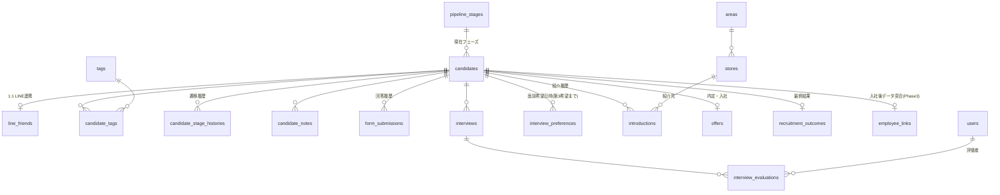
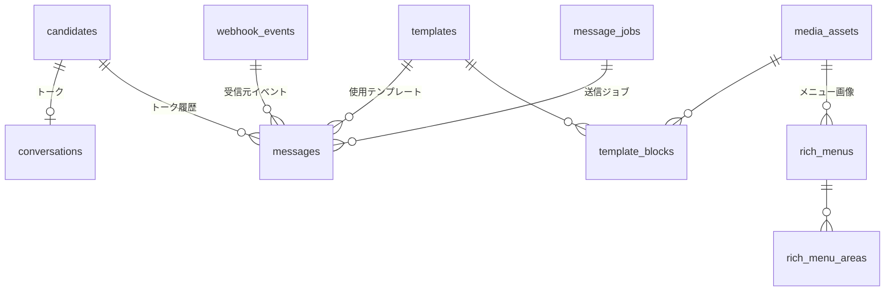
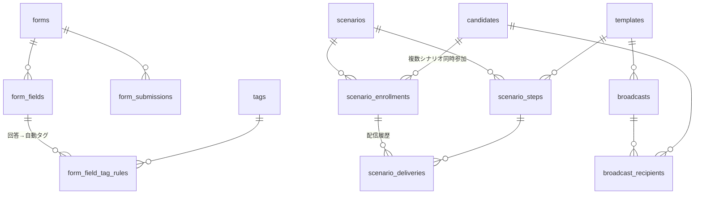

# 02. データベース設計とテーブル関連

対象：要件定義書 v1 第27章（開発方針 4・5）／第4〜21章の全データ要件

DBMS：PostgreSQL。全テーブルに `id`（UUID v7 相当）、`created_at`、`updated_at`（`timestamptz`）を持たせる。日時はすべて UTC で保存し、画面表示のみ Asia/Tokyo に変換する。

---

## 1. 設計の中心となる3つの判断

### 判断1：「LINE友だち」と「候補者」を1人物レコードに統合する

要件4のステータスは「LINE登録」から始まり、要件7は「応募していない見込み候補者も管理する」としている。したがって**友だち追加された時点で `candidates`（人物）レコードを作成**し、LINE 固有の情報だけを `line_friends` に 1:1 で分離する。

- 利点：タグ・検索・配信対象抽出・ファネル（LINEリスト数 → 応募数）がすべて同じテーブルを起点にできる。
- 求人媒体からの直接応募など LINE を経由しない候補者は `line_friends` を持たない `candidates` として登録できる。

### 判断2：選考フェーズをマスタテーブルにする

要件4のフェーズは20種類あり、要件22には「採用フロー設定」がある。フェーズをコード内の固定値にすると変更のたびに開発が必要になるため、`pipeline_stages` マスタで管理する。

- ただしダッシュボード・ファネルの集計は意味的な分類が必要なため、各フェーズに **`kind`（機械可読な分類）** と **`funnel_step`（ファネル上の位置）** を持たせ、集計ロジックはこの2つを参照する（表示名は自由に変更できる）。

### 判断3：フェーズ遷移を必ず履歴に残す

`candidate_stage_histories` を持つことで、要件20（各ステップの転換率）と要件24（入社後分析）に必要な「いつどのフェーズに到達したか」を後から再計算できる。**現在値だけを持つ設計にすると転換率もリードタイムも出せなくなる**ため、これは Phase 1 で必須とする。

---

## 2. 全体ER図（ドメイン別）

### 2-1. 人物・属性・選考のコア



### 2-2. LINE メッセージング



### 2-3. フォームと配信（Phase 2 含む）



---

## 3. テーブル定義

凡例：`PK` 主キー / `FK` 外部キー / `U` ユニーク / `IX` インデックス推奨 / `?` NULL 許容

### 3-1. 共通・認証

#### `users`（管理ユーザー）
| 列 | 型 | 説明 |
| --- | --- | --- |
| id | uuid PK | |
| email | text U | Google ログインの許可判定に使用 |
| name | text | 佐藤拓磨 / 若林 / 八尋 など |
| role | text | `admin` / `member`（初期は2種のみ。要件25） |
| kind? | text | `headquarters` / `director`（院長）/ `owner`（オーナー）。面談担当者の分類に使用 |
| is_active | bool | 退職・利用停止時に false |

#### `audit_logs`（操作ログ）
| 列 | 型 | 説明 |
| --- | --- | --- |
| id | uuid PK | |
| user_id? | uuid FK→users | システム実行時は NULL |
| action | text | `candidate.update` / `message.send` / `export` など |
| entity_type, entity_id | text, uuid | 対象 |
| diff? | jsonb | 変更前後 |
| ip?, user_agent? | text | |
| created_at | timestamptz IX | |

#### `app_settings`（システム設定）
キー・バリュー（jsonb）形式。LINE チャネル設定、既定テンプレートID、営業時間、配信の既定上限などを保持。

---

### 3-2. 人物・属性

#### `candidates`（候補者＝人物の中心テーブル）
| 列 | 型 | 説明 | 要件 |
| --- | --- | --- | --- |
| id | uuid PK | 全システムの突合キー | 24 |
| display_name? | text | LINE 表示名（応募前はこれのみ） | 7 |
| full_name? | text IX | 氏名 | 5 |
| full_name_kana? | text | ふりがな | |
| age? | int | 年齢（`birth_date` があればそちらを優先） | 5 |
| birth_date? | date | 年度をまたぐ年齢再計算のため推奨 | |
| phone?, email? | text | 連絡先 | |
| photo_path? | text | 顔写真（Storage の非公開パス） | 5 |
| nearest_station? | text IX | 最寄り駅 | 5, 21 |
| employment_category? | text | `new_grad`（新卒）/ `mid_career`（中途） | 3, 21 |
| licenses? | text[] IX(GIN) | 資格（柔道整復師 / 鍼灸師 / 理学療法士 / その他） | 5, 21 |
| experience_years? | numeric | 施術歴 | 5 |
| current_company?, current_store? | text | 現職・前職の会社名／店舗名 | 5 |
| change_reason? | text | 転職理由 | 5 |
| prev_salary? | int | 前職給与（円） | 5 |
| prev_working_hours? | text | 前職勤務時間 | 5 |
| prev_days_off? | text | 前職休日日数 | 5 |
| desired_area_id? | uuid FK→areas | 勤務希望エリア | 5, 21 |
| desired_area_text? | text | マスタ外の自由記述 | |
| change_timing? | text | 転職希望時期（`immediately` / `within_3m` / `within_6m` / `within_1y` / `undecided`） | 5, 21 |
| family_status? | text | 家庭状況 | 5 |
| questions? | text | 聞きたいこと | 5 |
| source? | text IX | 流入経路（Instagram / YouTube / 求人媒体 / 既存LINE / 紹介 / その他） | 8, 21 |
| source_detail? | text | 紹介者名など | |
| instagram?, x_account? | text | SNS アカウント | 5 |
| stage_id | uuid FK→pipeline_stages IX | **現在の選考フェーズ** | 4 |
| stage_changed_at | timestamptz | 現フェーズ到達日時（滞留日数の算出用） | 19 |
| status | text IX | `active` / `hired` / `declined`（辞退）/ `rejected`（不採用）。フェーズとは独立に「生きている候補者か」を判定 | 17 |
| owner_user_id? | uuid FK→users | 担当者 | |
| applied_at? | timestamptz IX | 応募確定日時 | 20 |
| fiscal_year? | int IX | 採用年度（ダッシュボードの年度フィルタ） | 19 |
| director_candidate? | bool IX | 院長候補フラグ（面談評価から反映） | 21 |
| overall_rating? | text IX | 最新の総合評価 A/B/C（検索高速化のための非正規化） | 21 |
| line_friend_at? | timestamptz IX | LINE 友だち登録日 | 7, 20 |
| last_contact_at? | timestamptz | 最終接触日時 | |
| memo? | text | 自由記述 | |

**インデックス**：`(stage_id, status)`、`(employment_category, fiscal_year)`、`(applied_at)`、`licenses` に GIN、氏名・会社名に対する日本語全文検索用インデックス（`pg_bigm` もしくは `LIKE` 用の trigram）。

#### `line_friends`（LINE 連携情報。candidates と 1:1）
| 列 | 型 | 説明 |
| --- | --- | --- |
| id | uuid PK | |
| candidate_id | uuid FK→candidates U | |
| line_user_id | text U IX | LINE の userId |
| display_name?, picture_url?, status_message?, language? | text | プロフィール API の取得値 |
| followed_at | timestamptz | 友だち追加日時 |
| unfollowed_at? | timestamptz | ブロック日時 |
| is_blocked | bool IX | 配信対象外判定に使用 |
| profile_synced_at? | timestamptz | プロフィール最終同期 |
| rich_menu_id? | uuid FK→rich_menus | 個別にリンク中のリッチメニュー |

#### `tags` / `candidate_tags`（要件8）
`tags`：`id` / `category`（`license`・`employment`・`concern`・`preference`・`behavior`・`source`・`other`）/ `name` U(category,name) / `color` / `is_system`（自動付与用の保護フラグ）/ `sort_order` / `is_active`。

`candidate_tags`：`candidate_id` FK / `tag_id` FK / `assigned_by?` FK→users / `assigned_via`（`manual` / `form` / `scenario` / `rich_menu` / `system`）/ `assigned_at`。主キーは `(candidate_id, tag_id)`。

> タグは削除可能だが、既に付与済みのタグを物理削除すると履歴が失われるため、**既定は `is_active=false` による無効化**とし、物理削除は確認ダイアログ付きで許可する。

#### `candidate_notes`（メモ・活動履歴）
`candidate_id` / `user_id` / `body` / `pinned` / `created_at`。候補者詳細のタイムライン表示に使用。

---

### 3-3. 選考フェーズ

#### `pipeline_stages`（フェーズマスタ／要件4）
| 列 | 型 | 説明 |
| --- | --- | --- |
| id | uuid PK | |
| code | text U | `line_registered`, `survey_pending`, `survey_done`, `not_applied`, `applied`, `interview1_waiting`, `interview1_scheduled`, `interview1_done`, `store_matching`, `store_visit_waiting`, `store_visit_scheduled`, `store_visit_done`, `final_waiting`, `final_scheduled`, `final_done`, `offer`, `offer_accepted`, `joining_scheduled`, `joined`, `declined`, `rejected` |
| name | text | 画面表示名（変更可） |
| kind | text | `prospect` / `applied` / `interview` / `visit` / `final` / `offer` / `joined` / `closed` |
| funnel_step? | int | ファネル上の位置（要件20）。NULL はファネル対象外 |
| sort_order | int | 表示順 |
| is_terminal | bool | 辞退・不採用など終端 |
| color | text | 画面での色 |
| is_active | bool | |

#### `candidate_stage_histories`（遷移履歴／要件19・20・24）
`candidate_id` FK IX / `from_stage_id?` / `to_stage_id` / `changed_by?` FK→users / `changed_via`（`manual` / `form` / `system`）/ `note?` / `changed_at` IX。

- ファネルの各ステップ到達人数は「その期間内に該当 `funnel_step` 以上へ到達した履歴」を数えることで、**現在フェーズが先に進んでいる候補者も正しくカウント**できる。
- 各フェーズの平均滞留日数（ボトルネック分析）も本テーブルから算出。

---

### 3-4. 面談・評価

#### `interviews`（面談／要件3・15）
| 列 | 型 | 説明 |
| --- | --- | --- |
| id | uuid PK | |
| candidate_id | uuid FK IX | |
| kind | text | `first`（一次・Zoom）/ `store_visit`（二次＋店舗見学）/ `final`（三次＋最終面談） |
| status | text IX | `scheduled` / `done` / `canceled` / `no_show` |
| scheduled_at? | timestamptz IX | 面談日時 |
| duration_min? | int | |
| interviewer_user_id? | uuid FK→users | 担当（一次＝佐藤、見学＝院長、最終＝オーナー） |
| interviewer_name? | text | ユーザー未登録の院長・オーナー用 |
| store_id? | uuid FK→stores | 見学店舗 |
| location? | text | |
| zoom_recording_url? | text | 録画URL（ファイルは保存しない／要件15） |
| zoom_passcode? | text | パスコード |
| zoom_meeting_id? | text | Phase2 の API 連携用 |
| result? | text | `pass` / `fail` / `hold` |
| note? | text | |

#### `interview_preferences`（面談希望日時／要件5）
`candidate_id` FK / `rank`（1〜3）/ `desired_at` timestamptz / `form_submission_id?`。ユニーク `(candidate_id, rank, form_submission_id)`。

#### `interview_evaluations`（面談評価／要件14）
| 列 | 型 | 説明 |
| --- | --- | --- |
| id | uuid PK | |
| interview_id | uuid FK IX | |
| candidate_id | uuid FK IX | 集計を速くするため冗長保持 |
| evaluator_user_id | uuid FK→users | |
| score_personality | smallint | 人柄（1〜5） |
| score_communication | smallint | 話し方 |
| score_experience | smallint | 経験 |
| score_skill | smallint | 技術 |
| score_motivation | smallint | 志望度 |
| score_retention | smallint | 長期勤務可能性 |
| score_culture_fit | smallint | NAORUとの相性 |
| overall | text | `A` / `B` / `C` |
| good_points? | text | 良かった点 |
| concerns? | text | 懸念点 |
| handover_note? | text | 次の担当者に確認してほしいこと |
| director_potential? | text | 院長を任せられそうなレベルか（`yes` / `maybe` / `no`） |
| memo? | text | 自由記述 |
| evaluated_at | timestamptz | |

> 7項目のスコアを**個別の列**として持つことで、要件24の「技術評価と売上」「人柄評価と定着率」といった分析をそのまま SQL で実行できる（JSONB にすると分析が煩雑になるため列を推奨）。評価入力後、`candidates.overall_rating` と `director_candidate` に最新値を反映する。

---

### 3-5. 店舗・エリアマッチング

#### `areas`（エリア／要件16）
`id` / `name`（例：東京・神奈川・大阪…）/ `prefecture?` / `sort_order` / `is_active`。

#### `stores`（店舗）
`id` / `name` / `area_id` FK / `owner_user_id?` FK→users / `owner_name?` / `director_name?` / `address?` / `is_active`。

> 現時点はエリア中心の運用のため、店舗マスタは「見学先・紹介先」として最小構成で持つ。

#### `introductions`（紹介履歴／要件16）
| 列 | 型 | 説明 |
| --- | --- | --- |
| id | uuid PK | |
| candidate_id | uuid FK IX | |
| store_id? | uuid FK→stores | 店舗単位の紹介 |
| area_id? | uuid FK→areas | エリア単位の紹介 |
| owner_user_id? | uuid FK→users | 紹介先オーナー |
| owner_name? | text | ユーザー未登録の場合 |
| sequence | int | 何番目の紹介か（Aオーナー→Bオーナーの順序） |
| introduced_at | timestamptz | 紹介日 |
| introduced_by? | uuid FK→users | 紹介した本部メンバー |
| response? | text | `want_to_hire`（採用したい）/ `interview_requested`（面談希望）/ `passed`（見送り）/ `pending`（保留） |
| responded_at? | timestamptz | |
| comment? | text | |

> **重要**：`introductions.response = 'passed'`（店舗の見送り）は候補者の不採用ではない。候補者自体の不採用は `candidates.status = 'rejected'` および `recruitment_outcomes` で表現し、両者を明確に分離する（要件16）。

---

### 3-6. 内定・入社・採用結果

#### `offers`（内定・入社管理／要件18）
| 列 | 型 | 説明 |
| --- | --- | --- |
| id | uuid PK | |
| candidate_id | uuid FK U | 1候補者1レコード |
| salary? | int | 給与（円） |
| salary_note? | text | 内訳・条件 |
| employment_type? | text | `full_time` / `contract` / `part_time` |
| store_id? | uuid FK→stores | 勤務地（店舗） |
| area_id? | uuid FK→areas | 勤務地（エリア） |
| offered_at? | timestamptz | 内定日 |
| accepted_at? | timestamptz | 内定承諾日 |
| join_date? | date IX | 入社日 |
| joined_at? | timestamptz | 入社確認日 |
| tokyo_seminar_attended? | bool | 東京セミナー参加有無 |
| tokyo_seminar_date? | date | |
| status | text | `offered` / `accepted` / `joining_scheduled` / `joined` / `withdrawn` |
| note? | text | |

#### `recruitment_outcomes`（採用結果／要件17）
`candidate_id` FK U / `result`（`hired` / `declined` / `rejected`）/ `reason_code`（`other_offer`（他社内定）/ `salary` / `location` / `timing` / `personality` / `experience` / `skill` / `license` / `unreachable`（連絡不通）/ `personal` / `store_side` / `other`）/ `reason_detail?` / `decided_at` / `decided_by?` FK→users。

#### `employee_links`（入社後分析の接続点／要件24）
`candidate_id` FK U / `employee_code` text（外部システムの従業員ID）/ `linked_at` / `joined_on` / `left_on?` / `source_system`。

> Phase 1 ではテーブルと候補者ID の払い出しのみ用意し、業績データ本体は Phase 3 で外部 API から取り込む。定着率・早期離職分析は `joined_on` / `left_on` で計算できる。

---

### 3-7. フォーム（アンケート・応募フォーム）

#### `forms`
`id` / `code` U（`initial_survey` / `application`）/ `name` / `description?` / `type`（`survey` / `application`）/ `is_active` / `success_template_id?` FK→templates / `settings` jsonb（送信後アクション：フェーズ変更先・付与タグ・送信動画など。要件6）。

#### `form_fields`
| 列 | 型 | 説明 |
| --- | --- | --- |
| id | uuid PK | |
| form_id | uuid FK | |
| key | text | 内部キー（`full_name` / `licenses` など） |
| label | text | 表示ラベル |
| field_type | text | `text` / `textarea` / `number` / `select` / `multiselect` / `radio` / `date` / `datetime` / `image` / `station` |
| options? | jsonb | 選択肢 |
| required | bool | |
| sort_order | int | |
| maps_to? | text | `candidates` の列名。設定されていれば回答を候補者レコードへ自動反映 |
| help_text? | text | |

#### `form_field_tag_rules`（回答に応じた自動タグ／要件9）
`form_field_id` FK / `match_value` text / `tag_id` FK→tags。例：「悩み＝労働時間」→ タグ「労働時間」。

#### `form_submissions`
`id` / `form_id` FK / `candidate_id` FK IX / `line_friend_id?` / `payload` jsonb（回答の生データ）/ `submitted_at` IX / `ip?` / `user_agent?` / `applied_actions` jsonb（実行済みの後処理。再実行防止）。

#### `form_access_tokens`（LIFF を使わない導線用）
`id` / `form_id` FK / `candidate_id` FK / `token` U / `expires_at` / `used_at?`。トーク内でパーソナライズURLを送る場合に使用。

---

### 3-8. LINE メッセージング

#### `webhook_events`（受信イベントの生ログ）
`id` / `line_event_id?` U / `type` / `line_user_id?` IX / `payload` jsonb / `received_at` IX / `processed_at?` / `process_error?` / `signature_valid` bool。

> **再送・重複対策の要**。LINE は同一イベントを再送することがあるため、`line_event_id`（`webhookEventId`）のユニーク制約で二重処理を防ぐ。障害時はこのテーブルから再処理できる。

#### `conversations`（トーク一覧／要件13）
`candidate_id` FK U / `last_message_at` IX / `last_inbound_at?` / `unread_count` / `handling_status`（`unhandled`（未対応）/ `in_progress` / `done`）IX / `assignee_user_id?` / `pinned` bool。

#### `messages`（トーク履歴・配信履歴／要件7）
| 列 | 型 | 説明 |
| --- | --- | --- |
| id | uuid PK | |
| candidate_id | uuid FK IX | |
| direction | text | `inbound` / `outbound` |
| message_type | text | `text` / `image` / `video` / `audio` / `file` / `sticker` / `location` / `flex` / `template` |
| text? | text | |
| media_path? | text | Storage 上のパス（受信メディアは取得して保存） |
| line_message_id? | text U | LINE 側のメッセージID |
| template_id? | uuid FK→templates | 使用テンプレート |
| sent_by_user_id? | uuid FK→users | 手動送信者 |
| send_channel? | text | `reply` / `push` / `multicast` / `narrowcast` |
| source_kind? | text | `manual` / `scenario` / `broadcast` / `form` / `rich_menu` / `auto` |
| source_id? | uuid | 上記の発生元ID |
| status | text | `queued` / `sent` / `failed` |
| error? | text | |
| webhook_event_id? | uuid FK | 受信元 |
| sent_at | timestamptz IX | |

**インデックス**：`(candidate_id, sent_at desc)`。トーク画面のページングに使用。

#### `message_jobs`（送信キュー）
`id` / `kind`（`push` / `multicast` / `scenario_step` / `broadcast_chunk`）/ `payload` jsonb / `candidate_id?` / `run_at` timestamptz IX / `status`（`pending` / `processing` / `done` / `failed` / `canceled`）IX / `attempts` / `last_error?` / `locked_at?` / `locked_by?` / `idempotency_key` U / `priority` int。

#### `templates` / `template_blocks`（要件11）
`templates`：`id` / `name` / `category`（`greeting` / `application` / `interview` / `visit` / `final` / `offer` / `appeal` / `other`）/ `description?` / `is_active` / `created_by`。

`template_blocks`：`template_id` FK / `sort_order` / `block_type`（`text` / `image` / `video` / `flex` / `buttons` / `uri`）/ `content` jsonb（LINE メッセージオブジェクトに変換可能な形式）/ `media_asset_id?` FK。

> 1テンプレート = 最大5吹き出し（LINE の1リクエスト上限）。テキスト内で `{{name}}` などの差し込み変数をサポートする。

#### `media_assets`（登録メディア／要件22）
`id` / `name` / `type`（`image` / `video` / `file`）/ `storage_path` / `public_url?` / `mime_type` / `size_bytes` / `width?` / `height?` / `duration_ms?` / `preview_path?`（動画のサムネイル。LINE の動画送信には必須）/ `uploaded_by`。

#### `rich_menus` / `rich_menu_areas`（要件12）
`rich_menus`：`id` / `name` / `image_asset_id` FK / `size`（`full`（2500x1686）/ `half`（2500x843））/ `chat_bar_text` / `line_rich_menu_id?`（LINE 側で発行されたID）/ `is_default` bool / `status`（`draft` / `published`）/ `published_at?`。

`rich_menu_areas`：`rich_menu_id` FK / `x` / `y` / `width` / `height` / `action_type`（`send_template` / `open_uri` / `open_form` / `open_survey` / `add_tag` / `start_scenario` / `switch_rich_menu`）/ `action_payload` jsonb（テンプレートID・URL・タグID など）/ `label`。

> タグ付与・シナリオ開始・メニュー切替は LINE の postback アクションで実装し、`action_payload` を postback データに埋め込む（詳細は `03`）。

---

### 3-9. 配信（Phase 2）

#### `scenarios`（シナリオ／要件10）
`id` / `name` / `description?` / `status`（`draft` / `active` / `paused`）/ `start_conditions` jsonb（タグ・フェーズ・フォーム回答の条件式）/ `stop_conditions` jsonb（例：フェーズが `offer` 以上になったら停止）/ `priority` int / `max_per_day` int / `send_window_start` / `send_window_end`（配信可能時間帯）/ `allow_duplicate` bool / `auto_enroll` bool。

#### `scenario_steps`
`scenario_id` FK / `step_no` / `template_id` FK / `delay_minutes?`（前ステップからの相対）/ `absolute_at?`（絶対日時指定）/ `send_at_time?`（当日の配信時刻）/ `conditions?` jsonb（このステップだけの追加条件）/ `is_active`。

#### `scenario_enrollments`（参加状況）
`id` / `scenario_id` FK / `candidate_id` FK / `status`（`active` / `completed` / `stopped`）IX / `current_step_no` / `next_send_at` timestamptz IX / `enrolled_at` / `enrolled_via` / `stopped_at?` / `stop_reason?`。ユニーク `(scenario_id, candidate_id)`（再参加を許す場合は `enrolled_at` を含める）。

> 1人が複数シナリオに同時参加する要件は、このテーブルが候補者に対して複数行を持てることで満たす。停止条件（内定到達時に選考シナリオを停止）は、フェーズ変更イベントを契機に `stop_conditions` を評価して `status='stopped'` に更新する。

#### `scenario_deliveries`（配信結果）
`enrollment_id` FK / `scenario_step_id` FK / `candidate_id` / `status`（`scheduled` / `sent` / `skipped` / `failed`）/ `scheduled_at` / `sent_at?` / `skip_reason?`（`daily_limit` / `duplicate` / `blocked` / `condition_unmet`）/ `message_id?` FK→messages。

#### `broadcasts` / `broadcast_recipients`（一斉配信）
`broadcasts`：`id` / `name` / `template_id` FK / `target_filter` jsonb（候補者検索条件と同じ形式）/ `scheduled_at?` / `status`（`draft` / `scheduled` / `sending` / `sent` / `canceled`）/ `total_count` / `sent_count` / `failed_count` / `created_by`。

`broadcast_recipients`：`broadcast_id` FK / `candidate_id` FK / `status` / `message_id?` / `error?`。

---

## 4. データ関連の要点（要件との対応表）

| 要件 | 実現方法 |
| --- | --- |
| 4. リアルタイム集計 | `candidates.stage_id` に対する `GROUP BY` 1本。フェーズ別カウントは1クエリで取得（インデックス `(stage_id, status)`） |
| 6. 応募確定時の自動処理 | `forms.settings` に「フェーズ変更先・付与タグ・送信テンプレート・送信動画」を定義し、送信時に**1トランザクション**で反映＋送信ジョブ登録。`form_submissions.applied_actions` で二重実行を防止 |
| 7. 候補者ごとの全履歴 | `candidates` を起点に `messages` / `form_submissions` / `scenario_deliveries` / `candidate_tags` / `candidate_stage_histories` を時系列マージし、詳細画面のタイムラインとして表示 |
| 10. 複数シナリオ同時参加 | `scenario_enrollments` が候補者ごとに複数行 |
| 10. 内定時のシナリオ自動停止 | フェーズ変更時に `stop_conditions` を評価して `status='stopped'` |
| 16. 見送りと不採用の区別 | `introductions.response='passed'`（店舗単位）と `candidates.status='rejected'`（候補者単位）を別テーブルで管理 |
| 19. 数字クリックで一覧表示 | ダッシュボードの各カードは候補者検索クエリのパラメータ（`stage`, `category`, `fiscal_year` …）に変換され、そのまま候補者一覧へ遷移 |
| 20. ファネル転換率 | `candidate_stage_histories` × `pipeline_stages.funnel_step` で「各ステップ到達人数」を期間集計し、隣接ステップ間の比率を算出 |
| 21. 検索条件 | `candidates` の列＋`candidate_tags`＋`interview_evaluations.overall`（非正規化列 `overall_rating`）で構成。タグ条件は AND/OR を選択可能に |
| 24. 入社後分析 | `candidates.id` ⇔ `employee_links.employee_code` の対応表。評価スコアが列で保持されているため、入社後データと結合するだけで分析可能 |

---

## 5. Prisma スキーマ抜粋（設計確認用の草案）

実装ではなく、**構造レビューのための抜粋**。全テーブルは Phase 1 着手時に確定する。

```prisma
model Candidate {
  id                  String   @id @default(uuid(7))
  displayName         String?
  fullName            String?
  fullNameKana        String?
  birthDate           DateTime? @db.Date
  age                 Int?
  phone               String?
  email               String?
  photoPath           String?
  nearestStation      String?
  employmentCategory  String?   // new_grad | mid_career
  licenses            String[]
  experienceYears     Decimal?
  currentCompany      String?
  currentStore        String?
  changeReason        String?
  prevSalary          Int?
  prevWorkingHours    String?
  prevDaysOff         String?
  desiredAreaId       String?
  changeTiming        String?
  familyStatus        String?
  questions           String?
  source              String?
  instagram           String?
  xAccount            String?

  stageId             String
  stageChangedAt      DateTime @default(now())
  status              String   @default("active") // active | hired | declined | rejected
  ownerUserId         String?
  appliedAt           DateTime?
  fiscalYear          Int?
  directorCandidate   Boolean  @default(false)
  overallRating       String?
  lineFriendAt        DateTime?

  stage               PipelineStage @relation(fields: [stageId], references: [id])
  desiredArea         Area?         @relation(fields: [desiredAreaId], references: [id])
  lineFriend          LineFriend?
  tags                CandidateTag[]
  stageHistories      CandidateStageHistory[]
  interviews          Interview[]
  introductions       Introduction[]
  offer               Offer?
  outcome             RecruitmentOutcome?
  submissions         FormSubmission[]
  messages            Message[]
  enrollments         ScenarioEnrollment[]

  createdAt           DateTime @default(now())
  updatedAt           DateTime @updatedAt

  @@index([stageId, status])
  @@index([employmentCategory, fiscalYear])
  @@index([appliedAt])
}

model LineFriend {
  id            String    @id @default(uuid(7))
  candidateId   String    @unique
  lineUserId    String    @unique
  displayName   String?
  pictureUrl    String?
  followedAt    DateTime
  unfollowedAt  DateTime?
  isBlocked     Boolean   @default(false)
  candidate     Candidate @relation(fields: [candidateId], references: [id], onDelete: Cascade)

  @@index([isBlocked])
}

model PipelineStage {
  id         String @id @default(uuid(7))
  code       String @unique
  name       String
  kind       String
  funnelStep Int?
  sortOrder  Int
  isTerminal Boolean @default(false)
  color      String  @default("#94a3b8")
  isActive   Boolean @default(true)
  candidates Candidate[]
}

model CandidateStageHistory {
  id          String   @id @default(uuid(7))
  candidateId String
  fromStageId String?
  toStageId   String
  changedBy   String?
  changedVia  String   @default("manual")
  note        String?
  changedAt   DateTime @default(now())
  candidate   Candidate @relation(fields: [candidateId], references: [id], onDelete: Cascade)

  @@index([candidateId, changedAt])
  @@index([toStageId, changedAt])
}

model InterviewEvaluation {
  id                String   @id @default(uuid(7))
  interviewId       String
  candidateId       String
  evaluatorUserId   String
  scorePersonality  Int
  scoreCommunication Int
  scoreExperience   Int
  scoreSkill        Int
  scoreMotivation   Int
  scoreRetention    Int
  scoreCultureFit   Int
  overall           String   // A | B | C
  goodPoints        String?
  concerns          String?
  handoverNote      String?
  directorPotential String?
  memo              String?
  evaluatedAt       DateTime @default(now())

  @@index([candidateId])
}
```

---

## 6. 初期データ（シード）

Phase 1 リリース時に投入するマスタ。

- `pipeline_stages`：要件4の20フェーズ（`code` は 3-3 の一覧のとおり）
- `tags`：要件8のタグ例（資格4・採用区分2・悩み7・行動5・流入6）
- `areas`：現在採用対象のエリア一覧（**要提供**）
- `stores`：見学・配属候補の店舗一覧（**要提供**）
- `users`：佐藤拓磨・若林・八尋
- `forms`：`initial_survey`（要件9の6項目）、`application`（要件5の全項目）
- `templates`：要件11の11種（文面は運用側から提供）
