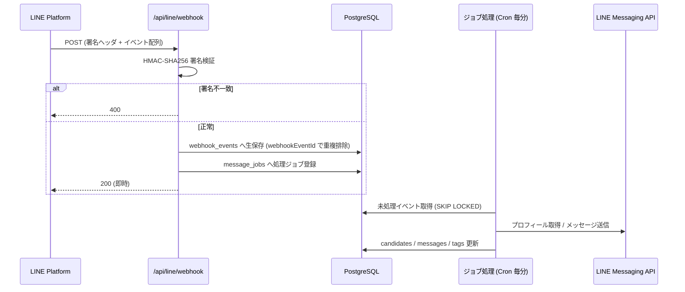
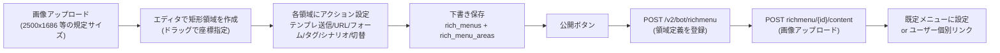
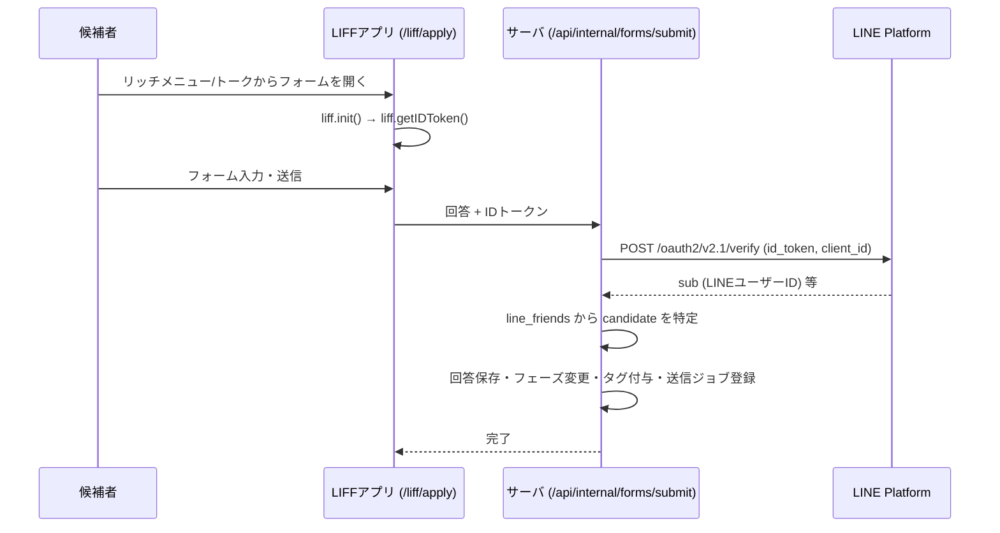

# 03. LINE Messaging API 連携設計

対象：要件定義書 v1 第27章（開発方針 6）／第2・6・7・9〜13章

> 本ドキュメントの API 仕様は設計時点の理解に基づく。**エンドポイント・上限値・料金プランは変更されるため、実装着手時に LINE 公式ドキュメントで再確認する**前提で記載している。
>
> **実装状況（Sprint 1 完了時点）**：第2〜4節（Webhook・イベント処理・push送信）は実装済み。
> 第5節（リッチメニュー）は Sprint 7、第6節（LIFF）は Sprint 3 で実装する。
> 実送信は `LINE_DRY_RUN=true` で止めており、解除は依頼者の確認後に行う運用とした。

---

## 1. 必要なチャネル構成

新規に作成する採用専用 LINE 公式アカウントに対し、**2つのチャネル**を用意する。

| チャネル | 用途 | 必要な情報 |
| --- | --- | --- |
| **Messaging API チャネル** | 友だち管理・メッセージ送受信・リッチメニュー | チャネルシークレット、チャネルアクセストークン |
| **LINEログインチャネル（LIFF）** | 初回アンケート・応募フォームでの本人特定 | チャネルID、LIFF ID |

### LINEログインチャネルが必要な理由

リッチメニューの URL アクションは**全友だちに同一の URL** が配信されるため、URL に個別トークンを埋め込めない。「リッチメニュー → 応募フォーム」でフォーム回答者が誰かを確実に特定するには、LIFF で LINE ユーザーIDを取得する方式が必要になる（要件12のアクション例に「応募フォームを開く」「アンケートを開く」が含まれるため）。

**代替（LIFF を使わない場合）**：トークメッセージからフォームを開く導線に限定し、`form_access_tokens` を含む個別 URL を送信する。この場合リッチメニューからのフォーム導線は「誰か分からない状態での回答」となり、LINE ユーザーIDとの突合が手作業になる。

> ✅ **決定（2026-08-17 / A-2）：LIFF を採用する。** LINEログインチャネルを追加作成し、初回アンケート・応募フォームの両方を LIFF で提供する。

### 環境変数

```
LINE_CHANNEL_SECRET          # Webhook 署名検証
LINE_CHANNEL_ACCESS_TOKEN    # 送信API（v2.1 の場合は下記で自動発行）
LINE_CHANNEL_ID              # チャネルアクセストークンv2.1 発行用
LINE_ASSERTION_PRIVATE_KEY   # 同上（JWT署名鍵）
LIFF_ID_SURVEY               # 初回アンケート用 LIFF
LIFF_ID_APPLY                # 応募フォーム用 LIFF
LINE_LOGIN_CHANNEL_ID        # IDトークン検証時の aud 検証用
```

**チャネルアクセストークン**：管理コンソール発行の長期トークンでも動作するが、失効・再発行の運用が属人化するため、**v2.1（JWT アサーション方式、有効期限つき）を採用し、期限前に自動更新**する実装を推奨する。

---

## 2. Webhook 受信設計

### 基本方針

**「検証 → 生ログ保存 → 即 200 応答 → 非同期処理」** の4段構成にする。Webhook 応答が遅い・失敗すると LINE 側で配信エラー扱いになるため、受信ハンドラ内では DB への INSERT 以外の重い処理を行わない。



### 署名検証

`x-line-signature` ヘッダの値と、**リクエストボディ（生バイト列）** をチャネルシークレットで HMAC-SHA256 → Base64 した値を比較する。Next.js の Route Handler では `await req.text()` で生ボディを取得してから JSON パースする（パース済みオブジェクトを再シリアライズすると署名が一致しない）。

### 重複排除

各イベントの `webhookEventId` を `webhook_events.line_event_id` にユニーク制約として保存する。LINE の再送（`deliveryContext.isRedelivery = true`）や、同一イベントの多重配信があっても二重処理されない。

### 障害時の再処理

`webhook_events` に生ペイロードを保持しているため、処理側のバグ修正後に `processed_at IS NULL` のイベントを再実行すれば復旧できる。

---

## 3. イベント別の処理

| イベント | 処理内容 | 関連要件 |
| --- | --- | --- |
| **follow**（友だち追加・ブロック解除） | プロフィール取得 → `candidates` ＋ `line_friends` を作成（既存なら `is_blocked=false` に復帰）→ フェーズ `line_registered` を設定 → 挨拶テンプレート送信 → アンケート導線（LIFF URL）送信 → タグ「LINE登録」＋流入タグを付与 → フェーズ `survey_pending` へ | 7, 9 |
| **unfollow**（ブロック） | `line_friends.is_blocked=true`、`unfollowed_at` 記録 → 実行中シナリオを停止 → 以後の配信対象から除外 | 10 |
| **message**（受信） | `messages` に保存（メディアはコンテンツ API で取得し Storage 保存）→ `conversations` を「未対応」に更新・`last_message_at` 更新 → 担当者へ通知（Slack 等） | 13 |
| **postback** | `data` に埋め込んだ JSON（`{"a":"send_template","id":"..."}` 等）を解釈し、テンプレート送信／タグ付与／シナリオ開始／リッチメニュー切替を実行 | 12 |
| **videoPlayComplete** | 「動画視聴対象」タグの精緻化（採用PV を最後まで見た友だちを識別）。Phase 2 のシナリオ分岐に利用 | 8, 10 |
| **accountLink** | 将来的に外部システムとの ID 連携が必要になった場合に使用（現時点では未使用） | — |
| その他（join / leave / beacon 等） | 記録のみ（グループ利用は想定しないため処理なし） | — |

### 応募確定時の処理（要件6）

フォーム送信の受信は Webhook ではなく LIFF からの API 呼び出しだが、後続処理は同じジョブ基盤を使う。

```
応募フォーム送信
 ├─ [同期・1トランザクション]
 │   ├─ form_submissions 保存
 │   ├─ candidates へ回答をマッピング（maps_to）
 │   ├─ フェーズを「応募済み」へ変更（candidate_stage_histories 記録）
 │   ├─ 自動タグ付与（応募済み / 資格 / 悩み / 希望エリア …）
 │   ├─ interview_preferences（第1〜3希望）を保存
 │   └─ applied_at / fiscal_year を設定
 └─ [非同期・message_jobs]
     ├─ 応募完了メッセージ送信（テンプレート）
     ├─ 指定動画の送信
     └─ 担当者へ通知（Slack / メール）
        → その後フェーズ「一次面談待ち」へ
```

同じフォームが二重送信された場合に備え、`form_submissions.applied_actions` に実行済み後処理を記録し、再実行を防ぐ。

---

## 4. メッセージ送信設計

### 送信方式の使い分け

| 方式 | エンドポイント | 用途 | 注意点 |
| --- | --- | --- | --- |
| **reply** | `POST /v2/bot/message/reply` | Webhook 受信への即時応答（挨拶・postback 応答） | replyToken は1回のみ・短時間で失効するため、**受信ハンドラから同期的に送る場合のみ**使用。ジョブ経由に回す場合は push を使う |
| **push** | `POST /v2/bot/message/push` | 1対1トーク、シナリオ配信、リマインド | 1リクエスト最大5吹き出し |
| **multicast** | `POST /v2/bot/message/multicast` | 一斉配信（対象リスト指定） | 1リクエスト最大500ユーザー。500件単位のチャンクジョブに分割 |
| **narrowcast** | `POST /v2/bot/message/narrowcast` | 属性条件での一斉配信 | 送信結果が非同期。オーディエンス管理が必要なため Phase 2 で検討 |

**設計上の原則**：`reply` 以外の送信はすべて `message_jobs` を経由させ、レート制御・リトライ・重複防止・送信記録（`messages`）を1箇所に集約する。

### 冪等性とリトライ

- push / multicast には **`X-Line-Retry-Key`（UUID）** を付与する。ネットワーク断でレスポンスを取り逃した際に再送しても、LINE 側で二重送信が防がれる。
- ジョブ側は `idempotency_key`（例：`scenario:{enrollment_id}:{step_id}`）でユニーク制約を張り、アプリ側でも二重登録を防ぐ。
- リトライは指数バックオフ（1分 → 5分 → 30分 → 2時間、最大5回）。`429`（レート超過）はバックオフして再試行、`400`系の恒久エラーは即 `failed` として記録し、担当者に通知。

### メッセージ本体の制約（実装時に要再確認）

| 項目 | 制約の目安 |
| --- | --- |
| 1リクエストの吹き出し数 | 5件まで |
| テキスト | 5,000文字まで |
| 画像 | JPEG/PNG、**公開HTTPS URL** が必要。プレビュー画像も指定 |
| 動画 | mp4、**公開HTTPS URL** が必要。プレビュー画像必須 |
| リクエストレート | 多くのエンドポイントで毎秒数千リクエスト程度。実運用では自前で秒間送信数を絞る |

**メディア配信の設計**：LINE は送信メディアに公開 HTTPS URL を要求するため、署名付き URL（有効期限あり）は使えない。`media_assets` のうち LINE 配信に使うものだけを**推測困難なパスの公開バケット**に置き、顔写真など候補者の個人情報は**非公開バケット＋署名付き URL**（管理画面表示のみ）と明確に分離する。

### 配信数の監視

無料メッセージ数の消費状況を `GET /v2/bot/message/quota` および消費数 API で日次取得し、管理画面の設定ページに表示する。シナリオ配信を本格稼働させると通数課金が発生するため、**残数の可視化を Phase 1 の設定画面に含める**。

---

## 5. リッチメニュー連携（要件12）

### 管理画面での作成フロー



- 画像サイズは LINE の規定値（2500×1686 / 2500×843 など）に限定し、アップロード時に検証する。
- 座標は LINE の仕様に合わせて**画像の実ピクセル座標**で保存し、管理画面のエディタ側で表示倍率を換算する。
- **アクションの実装方式**
  - テンプレート送信 / タグ付与 / シナリオ開始 → `postback` アクション（`data` に `{"a":"add_tag","id":"<tagId>"}` 等を格納）
  - URL・応募フォーム・アンケート → `uri` アクション（フォームは LIFF URL）
  - 別リッチメニュー切替 → `richmenuswitch` アクション（リッチメニューエイリアスの登録が必要）
- 公開時は「新しいメニューを作成 → 既定に設定 → 旧メニューを削除」の順で行い、切替時に空白期間が生じないようにする。
- LINE 側で発行された ID を `rich_menus.line_rich_menu_id` に保存し、システム側の下書きと LINE 側の実体を対応付ける。

---

## 6. LIFF（フォーム）連携

### 本人特定の流れ



**重要**：`liff.getProfile()` の結果をそのままサーバへ送ると改ざん可能なため、**必ず ID トークンをサーバ側で検証**し、`sub`（LINE ユーザーID）を信頼できる値として使う。

### フォームの作り分け

| フォーム | 実装 | 理由 |
| --- | --- | --- |
| **初回アンケート**（要件9・6項目） | LIFF の1画面フォーム（選択式中心） | 離脱を抑えるため短く。回答から自動タグ付与 |
| **応募フォーム**（要件5・20項目超） | LIFF の複数ステップフォーム（基本情報 → 現職 → 希望条件 → 面談希望） | 顔写真アップロードがあるため Web フォームが確実。入力途中の一時保存を実装 |

顔写真は LIFF から署名付きアップロード URL を取得して Storage へ直接アップロードし、サーバにはパスのみを渡す。

---

## 7. LINE 公式アカウント側の設定（運用チェックリスト）

システムと LINE 公式アカウント管理画面（LINE Official Account Manager）の設定が競合すると、**挨拶が二重送信される・Webhook が届かない**といった不具合になる。開設時に以下を確認する。

- [ ] 応答モードを **Bot（Webhook 利用）** に設定する
- [ ] **あいさつメッセージをオフ**にする（システム側の挨拶テンプレートと二重になるため）
- [ ] **応答メッセージ（自動応答）をオフ**にする
- [ ] **Webhook を有効化**し、URL を登録・検証する
- [ ] Webhook の再送設定（Redelivery）を有効にする
- [ ] LINE 側の「チャット」機能を利用するかを決める（管理画面の1対1トークと運用が二重化するため、**システム側に一本化を推奨**）
- [ ] アカウント認証（認証済アカウント）の申請可否を確認する
- [ ] 料金プランを配信通数の見込みから選定する
- [ ] 友だち追加経路の計測用に、媒体別の友だち追加 URL / QR を発行する（流入タグ付与に使用）

### 既存 LINE アカウントからの移行（2026-08-17 決定 / A-1）

**LINE公式アカウント間で友だちリストを移行することはできない。** 既存アカウントに登録済みの見込み候補者を新アカウントへ移すには、既存アカウントから新アカウントの友だち追加案内を配信して、本人に登録し直してもらう必要がある。

**決定内容**：既存 LINE はセミナー・アカデミー告知など採用以外の用途にも使用しているため統合はせず、**新規に採用専用アカウントを開設し、既存アカウントから誘導配信を行う**。

**設計・運用への反映**

| 項目 | 内容 |
| --- | --- |
| 誘導用の友だち追加 URL | 既存アカウントからの誘導専用パラメータを付けた URL を発行し、`follow` 時に流入経路 `既存LINE` として自動記録する |
| タグ | 移行者に **「既存LINE」タグを自動付与**。移行キャンペーンの効果測定に使う |
| 移行期間 | 例：1か月間、既存アカウントで複数回リマインド配信（初回・1週後・2週後・最終案内） |
| 効果測定 | 管理画面の流入分析で「既存LINE経由の友だち追加数」を日次で確認できるようにする |
| 注意 | 既存アカウント側の配信は採用以外の受信者にも届くため、**配信対象の絞り込み（セグメント配信）を既存アカウント側で行うか**は運用判断が必要 |

---

## 8. 流入経路（源泉）の識別

要件8・21の「流入」タグと要件19の流入分析を成立させるため、友だち追加時点で経路を判別する。

| 手段 | 内容 | 精度 |
| --- | --- | --- |
| **媒体別の友だち追加 URL** | `https://line.me/R/ti/p/@xxxx?...` に媒体別パラメータを付与し、`follow` イベント時の `source` として保存 | 中（LINE の仕様に依存するため実装時に検証が必要） |
| **アンケートで自己申告**（要件9） | 「NAORUを何で知ったか」の回答から自動タグ付与 | 高（ただし未回答者は不明） |
| **QRコードの出し分け** | 媒体ごとに異なるリッチメニュー / 初回メッセージ | 中 |

**推奨**：技術的な自動判別（URL パラメータ）を第一手段とし、アンケート回答で補正する二段構えにする。

---

## 9. 開発・検証環境

| 項目 | 方針 |
| --- | --- |
| 検証用チャネル | 本番とは別の Messaging API チャネル（テスト用の公式アカウント）を作成 |
| ローカル開発 | `ngrok` 等でローカルへトンネルし、検証チャネルの Webhook URL に設定 |
| Preview 環境 | Vercel の Preview URL は毎回変わるため、検証は「固定の検証環境（staging ドメイン）」に集約する |
| 送信のモック | ローカル・テスト時は LINE API 呼び出しをモックに切替（環境変数 `LINE_DRY_RUN=true`）。実送信事故を防ぐ |
| テスト観点 | 署名検証の失敗、重複イベント、ブロック済みユーザーへの送信、レート超過、フォーム二重送信 |

---

## 10. 監視・アラート

| 監視対象 | 閾値・条件 | 通知先 |
| --- | --- | --- |
| Webhook のエラー率 | 5分間で 5xx が発生 | Sentry → Slack |
| 未処理の `webhook_events` | 10分以上滞留 | Slack |
| 送信ジョブの失敗 | `failed` が発生 | Slack |
| 無料メッセージ残数 | 残り20%を下回る | Slack |
| チャネルアクセストークン | 有効期限7日前 | Slack |
| 未対応トーク | 受信から24時間未対応 | Slack（担当者リマインド） |
